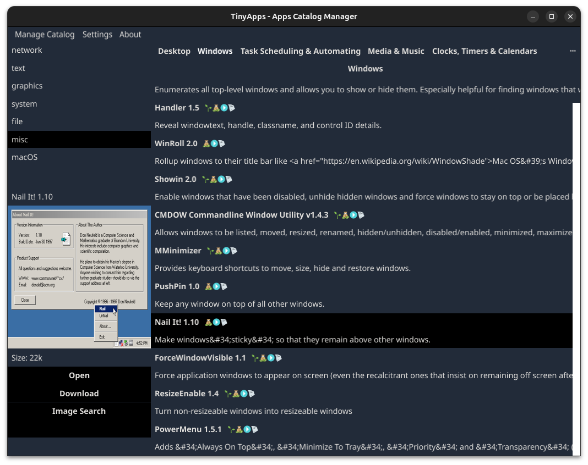

#   Tinyapps.org Apps Catalog Manager

## About Software

**TinyApps Catalog Manager** provides easy catalog listing of applications fetched from tinyapps.org site.

It is organized by category of applications. Each category of applications are organized on each tabs of subcategories. By clicking on tabs there are listing of apps.

## Goal

Providing "app store manager" from tinyapps.org sites. Tinyapps.org cataloged tiny, well-made software for ages.

Read their FAQ: https://tinyapps.org/faq

## Preview

## Features

v1.0
- manually updating catalog software from menu
- reverting or fetching locally data from data assets (no tinyapps.org page used)
- switching default from minimal tinyapps.org original theme or fyne default theme
- filtering supreme apps, shareware, no install type or source code apps
- download apps catalog information locally from tinyapps.org site and refreshing store manager apps
- view image source of apps on Google Lens
- open site and URL of apps
- preview image of apps
- preview filesize of applications

## Developers

Maintainer: 
- Marin Sagovac, August 2023